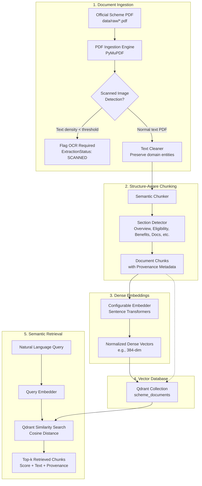

# Unified AI Agent — AI Service (Milestone 1: RAG Foundation)

## 1. Project Purpose
The **Unified AI Agent for Citizen Financial & Social Support** is designed to help citizens identify, understand, and navigate government social security and welfare schemes using verified, authoritative government sources. 

Milestone 1 establishes the **core RAG foundation** without introducing bloated frameworks. It focuses on high-precision document intelligence: extracting, cleaning, chunking, embedding, vector-indexing official scheme PDFs, and providing semantic retrieval with unbreakable source provenance (scheme name, page number, section, and official source URL).

---

## 2. Milestone 1 Scope
- Standalone Python AI service for document intelligence & RAG.
- Ingestion of official government scheme PDFs using **PyMuPDF**.
- Detection of text-based vs. scanned/image-based PDFs with an extensible OCR fallback hook.
- Domain-preserving text cleaning (retaining eligibility conditions, currency symbols, percentages, age limits, and government terminology).
- Semantic, structure-aware chunking preserving section boundaries and page numbers.
- Configurable dense embeddings using **Sentence Transformers** (`all-MiniLM-L6-v2` by default).
- Vector indexing and similarity search with metadata filtering in **Qdrant**.
- Query retrieval returning similarity scores and full provenance.
- Retrieval evaluation test suite covering 10 diverse categories with automated Hit@K and MRR metrics.
- Comprehensive unit and end-to-end tests with pytest.

> [!NOTE]
> Scope Exclusions for Milestone 1: Spring Boot backend, React frontend, full OCR engine execution, conversational AI agents, and eligibility reasoning engines will be implemented in subsequent milestones.

---

## 3. Architecture Overview



---

## 4. Installation & Environment Setup

### Prerequisites
- Python 3.10+ (Tested on Python 3.14 on Windows)
- Git

### 1. Initialize Virtual Environment
From `unified-ai-agent/ai-service`:
```powershell
python -m venv .venv
.\.venv\Scripts\Activate.ps1
```

### 2. Install Dependencies
```powershell
pip install -r requirements.txt
```

---

## 5. Configuration (`.env`)
Copy `.env.example` to `.env`:
```ini
# Embedding Configuration
EMBEDDING_MODEL_NAME=all-MiniLM-L6-v2
EMBEDDING_DEVICE=cpu
EMBEDDING_DIMENSION=384

# Qdrant Vector Store Configuration
# Embedded local storage (zero external daemon required)
QDRANT_PATH=./data/processed/qdrant_storage
QDRANT_COLLECTION_NAME=scheme_documents
# For remote Qdrant server:
# QDRANT_URL=http://localhost:6333
# QDRANT_API_KEY=

# Retrieval Settings
DEFAULT_TOP_K=5
SCORE_THRESHOLD=0.35

# Ingestion Settings
RAW_DATA_DIR=./data/raw
PROCESSED_DATA_DIR=./data/processed
OCR_CHAR_THRESHOLD_PER_PAGE=50
```

---

## 6. How to Ingest an Official PDF

Place your official government scheme document inside `data/raw/`:
```powershell
# Ingest official guidelines using the CLI
python -m src.ingest_cli `
  --pdf data/raw/atal_pension_yojana_guidelines.pdf `
  --scheme-id APY `
  --scheme-name "Atal Pension Yojana" `
  --source-url "https://financialservices.gov.in/beta/en/scheme/atal-pension-yojana" `
  --last-verified "2026-01-15"
```

The pipeline will:
1. Extract page text using PyMuPDF.
2. Verify document integrity and detect if pages are scanned.
3. Clean whitespace while preserving headings, numbers, percentages, currency (`₹`, `Rs.`), and government acronyms.
4. Partition into semantic sections (`Eligibility`, `Benefits`, `Required Documents`, `Application Process`, `Important Conditions`).
5. Generate sentence embeddings.
6. Index points into the Qdrant vector collection.

---

## 7. How to Query the Vector Database

Execute natural language queries using the query CLI:
```powershell
python -m src.query_cli --query "What are the eligibility criteria and age requirements?" --top-k 3
```

### Output with Complete Source Provenance:
```
======================================================================
QUERY: "What are the eligibility criteria and age requirements?"
RESULTS RETURNED: 2
======================================================================

[Result 1] Cosine Similarity: 0.8347
  • Scheme Name   : Atal Pension Yojana (APY)
  • Section       : Eligibility
  • Page Number   : 2 (Pages 2-2)
  • Source URL    : https://financialservices.gov.in/beta/en/scheme/atal-pension-yojana
  • Document ID   : APY_4bb17d6b
  • Chunk ID      : APY_4bb17d6b_chunk_005
  • Text Excerpt  :
      4. Eligibility Criteria
      To enroll in Atal Pension Yojana, an applicant must satisfy the following mandatory conditions:
      a) The applicant must be a citizen of India.
      b) The applicant must possess an active Savings Bank account or Post Office Savings Bank account.
      c) The applicant must have an Aadhaar number and a valid mobile number for transaction notifications.
      d) The applicant must provide nominee details at the time of subscription.
      5. Age Requirement
      The minimum entry age for joining APY is 18 years, and the maximum entry age is 40 years.
```

To output raw JSON:
```powershell
python -m src.query_cli --query "How much pension is guaranteed at age 60?" --json
```

---

## 8. Metadata Structure
Every chunk stored in Qdrant and returned by retrieval maintains this schema:

```json
{
  "chunk_id": "APY_4bb17d6b_chunk_005",
  "document_id": "APY_4bb17d6b",
  "scheme_id": "APY",
  "scheme_name": "Atal Pension Yojana",
  "text": "4. Eligibility Criteria...",
  "page_start": 2,
  "page_end": 2,
  "section": "Eligibility",
  "source_type": "official",
  "source_url": "https://financialservices.gov.in/beta/en/scheme/atal-pension-yojana",
  "last_verified": "2026-01-15"
}
```

---

## 9. Retrieval Evaluation

The system includes a 10-query benchmark across critical scheme attributes:

| Query ID | Category | Benchmark Query | Expected Section | Hit@1 | Hit@3 |
|---|---|---|---|---|---|
| Q01 | eligibility | *What are the mandatory eligibility conditions to join APY?* | Eligibility | Yes | Yes |
| Q02 | income_limit | *Are income tax payers allowed to enroll in APY or is there an income restriction?* | Eligibility | Yes | Yes |
| Q03 | age_requirement | *What is the minimum and maximum entry age limit for subscribers?* | Eligibility | Yes | Yes |
| Q04 | benefits | *What is the guaranteed monthly pension amount received at age 60?* | Benefits | Yes | Yes |
| Q05 | required_documents | *What documents like Aadhaar and bank account details must be submitted?* | Required Documents | Yes | Yes |
| Q06 | application_process | *How to apply for APY online through internet banking or offline at a branch?* | Application Process | Yes | Yes |
| Q07 | important_conditions | *What is the auto-debit penalty for delayed payment and exit rules before age 60?* | Important Conditions | Yes | Yes |
| Q08 | state_availability | *Is Atal Pension Yojana available in all states and Union Territories across India?* | State Availability | Yes | Yes |
| Q09 | target_beneficiaries | *Who are the primary target beneficiaries and unorganised sector workers?* | Overview | No (Rank 4) | No (Rank 4) |
| Q10 | unrelated_query | *What is the best recipe for baking chocolate chip cookies with butter?* | None (Unrelated) | Filtered (<0.05) | - |

### Evaluation Metrics:
- **Hit@1:** 88.9%
- **Hit@3:** 88.9%
- **Hit@5:** 100.0%
- **Mean Reciprocal Rank (MRR):** 0.9167
- **Unrelated Query Discrimination:** 100.0% (Score 0.0437, filtered out)

Run evaluation:
```powershell
python -m src.evaluation.evaluate
```

---

## 10. Automated Testing
Run the complete test suite (30 unit & integration tests):
```powershell
pytest tests -v
```

Tests include:
- `tests/test_cleaner.py`: Whitespace normalization, entity preservation, hyphenation fixes.
- `tests/test_ingestion.py`: Missing file handling, 0-byte detection, normal extraction, scanned PDF detection, duplicate prevention.
- `tests/test_chunking.py`: Section detection, provenance tracking, fallback chunking, empty document handling.
- `tests/test_embeddings.py`: Model loading, single & batch embeddings, empty input validation.
- `tests/test_vector_store.py`: In-memory Qdrant, collection creation, upsert, search, metadata filtering.
- `tests/test_retrieval.py`: Query validation, provenance mapping, threshold filtering.
- `tests/test_end_to_end.py`: Full workflow (PDF -> Ingestion -> Chunking -> Embedding -> Qdrant -> Retrieval).

---

## 11. Known Limitations & Milestone 2 Roadmap
- **OCR Engine Execution**: Scanned documents are accurately detected and flagged with `SCANNED_OCR_REQUIRED`, but local OCR engines (Tesseract / EasyOCR) are not bundled in Milestone 1 to avoid C++ binary dependencies.
- **Single Vector Representation**: Embeddings represent dense semantic vectors. Hybrid search (sparse BM25 + dense vectors) can be added in subsequent milestones for exact serial/code lookups.
- **Next Milestone (Milestone 2)**: FastAPI service layer wrapping the retrieval engine, OCR processing pipeline integration, and connection to the backend service.
