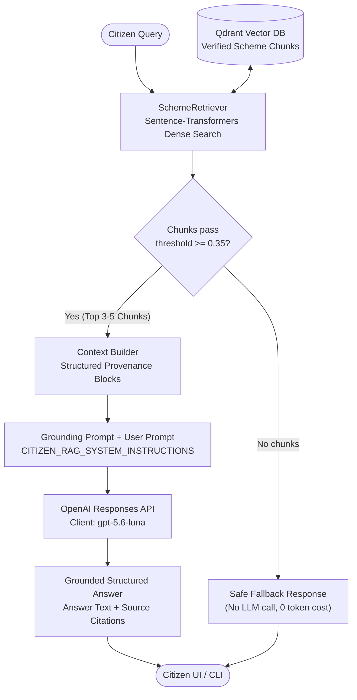
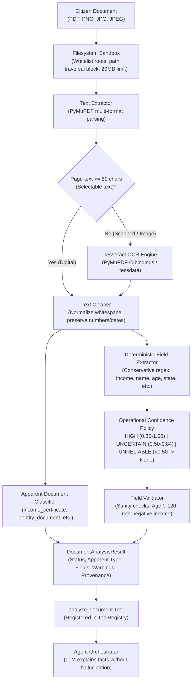

# Unified AI Agent — AI Service (Milestone 1 & 2: RAG Foundation + OpenAI LLM)

## 1. Project Purpose
The **Unified AI Agent for Citizen Financial & Social Support** is designed to help citizens identify, understand, and navigate government social security and welfare schemes using verified, authoritative government sources.

- **Milestone 1 (RAG Foundation)**: Established high-precision document intelligence: extracting, cleaning, structure-aware chunking, dense vector embedding, indexing into **Qdrant**, and semantic retrieval with unbreakable source provenance (scheme name, section, page number, and source URL).
- **Milestone 2 (RAG + OpenAI LLM)**: Connects the verified retrieval engine to **OpenAI Responses API** (`gpt-5.6-luna`), generating grounded, citizen-friendly explanations strictly based on retrieved evidence without hallucinating facts.

---

## 2. Milestone 2 Architecture

In this architecture, **Qdrant provides the authoritative evidence** from official government publications, while the **OpenAI LLM generates the grounded response** strictly adhering to that evidence.



### Core M2 Components:
- **`src/llm/client.py`**: OpenAI client abstraction utilizing the official `openai` Python SDK Responses API (`client.responses.create`). Features secret sanitization to prevent API key leakage in logs or exceptions.
- **`src/llm/prompts.py`**: Strong developer grounding instructions enforcing 9 strict citizen-safety rules (no extrapolation, exact numerical preservation, explicit declaration when evidence is missing, source citations).
- **`src/rag/context_builder.py`**: Assembles retrieved chunks into distinct source blocks preserving scheme name, document ID, section, page numbers, similarity score, and text.
- **`src/rag/answer_generator.py`**: Orchestrates retrieval, guards against below-threshold queries (zero LLM calls on irrelevant queries), and outputs a structured `GroundedAnswer`.
- **`src/chat_cli.py`**: Interactive terminal chat interface supporting both full Grounded RAG + LLM and retrieval-only modes.

---

## 3. Installation & Setup

### Prerequisites
- Python 3.10+ (Verified on Python 3.14 on Windows)
- Git

### 1. Initialize Virtual Environment
From `unified-ai-agent/ai-service`:
```powershell
python -m venv .venv
.\.venv\Scripts\Activate.ps1
```

### 2. Install Dependencies
```powershell
pip install -r requirements.txt
```
Dependencies: `pymupdf`, `sentence-transformers`, `qdrant-client`, `python-dotenv`, `pytest`, `pydantic`, `numpy`, `openai`.

---

## 4. Configuration (`.env`)

> [!CAUTION]
> **SECURITY WARNING: NEVER COMMIT `.env` TO GIT.**
> Your `.env` contains local API secrets. Verify that `.gitignore` contains `.env`, `.env.*`, and `!.env.example`. Never paste your real API key into `.env.example` or commit it to GitHub.

Create or update `.env` in `unified-ai-agent/ai-service/.env`:
```ini
# ==========================================
# AI Service Configuration
# ==========================================

# Embedding Configuration
EMBEDDING_MODEL_NAME=all-MiniLM-L6-v2
EMBEDDING_DEVICE=cpu
EMBEDDING_DIMENSION=384

# Qdrant Vector Store Configuration
QDRANT_PATH=./data/processed/qdrant_storage
QDRANT_COLLECTION_NAME=scheme_documents

# Retrieval Settings
DEFAULT_TOP_K=5
SCORE_THRESHOLD=0.35

# Ingestion Settings
RAW_DATA_DIR=./data/raw
PROCESSED_DATA_DIR=./data/processed
OCR_CHAR_THRESHOLD_PER_PAGE=50

# OpenAI LLM Configuration (Milestone 2)
OPENAI_API_KEY=your_actual_openai_api_key_here
OPENAI_MODEL=gpt-5.6-luna
```

---

## 5. Running the Grounded RAG Chat CLI

### Interactive RAG + LLM Chat
Launch the interactive assistant in PowerShell:
```powershell
python -m src.chat_cli
```

Example interaction:
```
======================================================================
  CITIZEN SCHEME AI ASSISTANT — GROUNDED RAG CHAT (MILESTONE 2)
======================================================================
Connecting to verified scheme vector store...
[MODE] Grounded RAG active with OpenAI model: 'gpt-5.6-luna'

[READY] Assistant online in [RAG + OpenAI LLM] mode.
Ask any question about verified government schemes. Type 'exit' or 'q' to stop.

Citizen Query > What are the eligibility criteria for a startup?

Assistant:
To be eligible under the Startup India Seed Fund Scheme, a startup must satisfy the following conditions:
1. It must be recognized by DPIIT and incorporated not more than 2 years ago at the time of application.
2. It must have a business idea to develop a product or service with market fit, viable commercialization, and scope for scaling.
3. It must use technology in its core product, service, business model, or methodology.
4. Shareholding by Indian promoters must be at least 51% at the time of application.
5. The startup must not have received more than Rs. 10 Lakhs of monetary support under any other Central or State Government scheme (excluding competitions/prize money).

Sources:
- Guidelines For Startup India Seed Fund Scheme
  Page 2 — Eligibility (https://www.startupindia.gov.in)
----------------------------------------------------------------------
```

### Retrieval-Only Mode (No LLM)
If you wish to test raw chunks without calling OpenAI or when `OPENAI_API_KEY` is not set:
```powershell
python -m src.chat_cli --retrieval-only
```

---

## 6. How to Ingest a Government Scheme PDF

Place official PDFs in `data/raw/` and run the ingestion CLI:
```powershell
python -m src.ingest_cli `
  --pdf data/raw/Guidelines_for_Startup_India_Seed_Fund_Scheme.pdf `
  --scheme-id SISFS `
  --scheme-name "Startup India Seed Fund Scheme" `
  --source-url "https://www.startupindia.gov.in"
```

The pipeline:
1. Extracts page text and counts characters/images via PyMuPDF.
2. Verifies document health and detects scanned/image pages.
3. Normalizes text while preserving currency (`₹`, `Rs.`), dates, age limits, and statutory terms.
4. Chunks into logical sections (`Overview`, `Eligibility`, `Benefits`, `Important Conditions`).
5. Generates 384-dimensional dense vectors using Sentence Transformers.
6. Stores vector points and provenance metadata into local embedded Qdrant.

---

## 7. Automated Testing & Verification

Run the full pytest suite (40 unit & integration tests):
```powershell
pytest -v
```

### Test Coverage Summary:
- `tests/test_rag.py` (10 tests):
  - Context builder creates structured source metadata and labeled context blocks.
  - Missing API key raises `MissingAPIKeyError` safely without exposing secrets.
  - Empty or below-threshold retrieval completely bypasses the LLM.
  - Grounding prompt incorporates all 9 critical government assistance tenets.
  - API errors sanitize secret keys (`[REDACTED_API_KEY]`).
  - Structured answer validation (`GroundedAnswer` schema).
  - Mocked end-to-end RAG answer generation.
- `tests/test_openai_integration.py` (1 test): Live connection test (auto-skipped when `OPENAI_API_KEY` is not present).
- `tests/test_cleaner.py` (5 tests): Text cleaning and entity preservation.
- `tests/test_chunking.py` (4 tests): Structure-aware section chunking and fallback.
- `tests/test_embeddings.py` (5 tests): Embedder initialization, batching, and error handling.
- `tests/test_vector_store.py` (6 tests): Qdrant lifecycle, upsert, search, and filtering.
- `tests/test_retrieval.py` (3 tests): Query validation and provenance mapping.
- `tests/test_end_to_end.py` (1 test): Full PDF-to-retrieval pipeline integration.

### Milestone 1 Benchmark Evaluation:
To re-verify retrieval precision across the 10-query benchmark dataset:
```powershell
python -m src.evaluation.evaluate
```
**Current Benchmark Results:**
- **Hit@1:** 100.0%
- **Hit@3:** 100.0%
- **Hit@5:** 100.0%
- **MRR:** 1.0000
- **Unrelated Query Discrimination:** 100.0%

---

## 8. Milestone 3: Agent Orchestrator & Tool Calling

Milestone 3 upgraded the architecture from a static RAG pipeline to an autonomous **Agent Orchestrator with Function Calling** via the OpenAI Responses API (`client.responses.create`).

### Key Capabilities:
- **Autonomous Multi-Turn Execution**: Evaluates user intent and dynamically calls authorized tools up to a strict 5-turn ceiling.
- **Whitelist Tool Registry**: Only authorized Python tools can be executed. Rejects arbitrary shell, SQL, Python, or network commands.
- **Registered Tools**:
  - `search_government_schemes`: Semantic retrieval over official government scheme documents with provenance.
  - `get_citizen_profile`: Retrieves demographic attributes (demo/mock data) with mandatory transparency notice.
  - `get_application_status`: Tracks application progress (demo/mock data) with mandatory transparency notice.
- **Safe Quota Fallback**: If the OpenAI API returns 429 quota exhaustion, the agent fails safely without fabricating answers and falls back to verified RAG evidence and mock notices.

---

## 9. Milestone 4: Document AI / OCR & Agent Tool

Milestone 4 introduces an end-to-end **Document AI and OCR pipeline**, exposed as a new tool (`analyze_document`) in the Agent Orchestrator.

### Core Principles:
1. **"Document AI extracts facts. The Agent orchestrates. The LLM explains."**
   - The LLM never determines, guesses, or invents extracted document fields.
   - Document AI extracts deterministic evidence; the LLM merely communicates and explains those facts.
2. **"Document type classification is not document authenticity verification."**
   - The system identifies what a document *appears* to be based on observable textual features.
   - It explicitly does **NOT** verify whether a document is genuine, legally valid, government-issued, or authentic.
3. **Strict Scope Boundaries**:
   - M4 does **NOT** perform Aadhaar number verification, PAN verification, biometric matching, or face recognition.



### Supported Formats & Capabilities:
- **Formats**: `.pdf`, `.png`, `.jpg`, `.jpeg` (Max size: 20 MB).
- **OCR Engine**: PyMuPDF native C/C++ bindings to Tesseract (`C:\Program Files\Tesseract-OCR\tessdata`). Zero additional heavyweight Python dependencies.
- **Selective OCR**: Only executes OCR when a page contains fewer than 50 selectable characters.
- **Apparent Document Categories**:
  - `income_certificate`
  - `identity_document`
  - `address_document`
  - `education_certificate`
  - `unknown`
- **Supported Fields**: `annual_income`, `name`, `age`, `gender`, `date_of_birth`, `state`, `district`, `occupation`, `document_number`, `issue_date`.
- **Operational Confidence Policy**:
  - **HIGH (0.85 - 1.00)**: Strong deterministic match, context confirmed, passes validation.
  - **UNCERTAIN (0.50 - 0.84)**: Matched pattern with ambiguous context or OCR artifacts; value returned with diagnostic warning.
  - **UNRELIABLE (< 0.50)**: Ambiguous or invalid; value forced to `None` (NEVER guess).
- **Filesystem Sandboxing**: Whitelisted access strictly limited to `data/documents/`, `data/raw/`, and `tests/fixtures/documents/`. All path traversal attempts (`../`) and executable extensions (`.exe`, `.bat`, `.sh`, `.py`, `.dll`) are strictly blocked.

### Standalone Document CLI:
```powershell
# Analyze a digital PDF
python -m src.document_cli --file tests/fixtures/documents/digital_income_certificate.pdf

# Analyze a scanned PNG via Tesseract OCR
python -m src.document_cli --file tests/fixtures/documents/scanned_income_certificate.png
```

---

## 10. Automated Testing & Verification

Run the full pytest suite (62 unit & integration tests across M1–M4):
```powershell
pytest -v
```

### Test Suite Structure:
- `tests/test_document_ai.py` (6 tests):
  - Digital PDF extraction (no OCR, page provenance preserved).
  - Scanned PNG OCR with **actual field recovery** (`annual_income == 150000`, `name == "Demo Citizen"`, `ocr_used == True`).
  - Missing field handling (returns `None` without guessing).
  - Operational confidence levels (`HIGH`, `UNCERTAIN`, `UNRELIABLE`).
  - Field validation & sanity diagnostics (catches negative income, invalid age without crashing).
  - Provenance preservation (page numbers, source snippets, SHA-256).
- `tests/test_document_tool.py` (5 tests):
  - `analyze_document` tool registration, schema export, and description.
  - Strict filesystem sandboxing (traversal rejection, outside-sandbox rejection, executable rejection, empty/corrupt handling).
  - Valid tool execution returning structured facts and non-authenticity disclaimer.
  - Agent Orchestrator + Document tool integration flow (mock LLM, zero live API cost).
  - Agent handling of missing document fields (verifies LLM does not invent fields).
- `tests/test_agent.py` (10 tests): Agent orchestrator, tool registry, multi-tool flows, and 5-step loop ceiling.
- `tests/test_rag.py` (10 tests): Grounded RAG, context assembly, and OpenAI Responses API client.
- `tests/test_cleaner.py` (5 tests): Text cleaning and entity preservation.
- `tests/test_chunking.py` (4 tests): Structure-aware section chunking.
- `tests/test_embeddings.py` (5 tests): Sentence Transformer embeddings.
- `tests/test_vector_store.py` (6 tests): Qdrant vector database storage and search.
- `tests/test_retrieval.py` (3 tests): Query validation and provenance mapping.
- `tests/test_end_to_end.py` (1 test): Complete M1 ingestion-to-retrieval pipeline.
- `tests/test_openai_integration.py` (1 test): Live OpenAI call (skipped gracefully during credit exhaustion).

### Milestone 1 Benchmark Evaluation:
```powershell
python -m src.evaluation.evaluate
```
- **Hit@1:** 100.0% | **Hit@3:** 100.0% | **Hit@5:** 100.0% | **MRR:** 1.0000 | **Unrelated Discrimination:** 100.0%

---

## 11. Milestone Roadmap
- [x] **Milestone 1**: Standalone RAG Foundation (PyMuPDF, Semantic Chunking, Embeddings, Qdrant Vector DB, Provenance, Benchmark Evaluation).
- [x] **Milestone 2**: Grounded RAG + OpenAI Responses API (`gpt-5.6-luna`), Context Builder, Citizen Grounding Prompt, Structured Answers, Interactive Chat CLI.
- [x] **Milestone 3**: Agent Orchestrator + Tool Calling (Responses API Tools, Tool Registry, Whitelisting, Provenance, 5-Step Loop Limit, Safe Quota Handling).
- [x] **Milestone 4**: Document AI / OCR Pipeline + `analyze_document` Agent Tool (PyMuPDF, Tesseract OCR, Apparent Document Classification, Conservative Field Extraction, Operational Confidence Policy, Sandbox Security).
- [ ] **Milestone 5**: Eligibility Rule Engine & Citizen Application Guidance.
